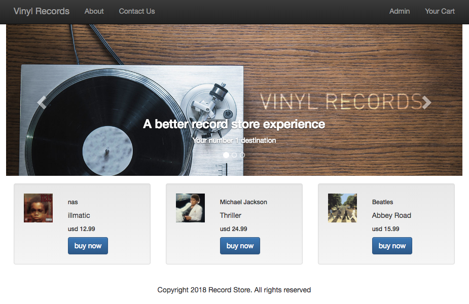
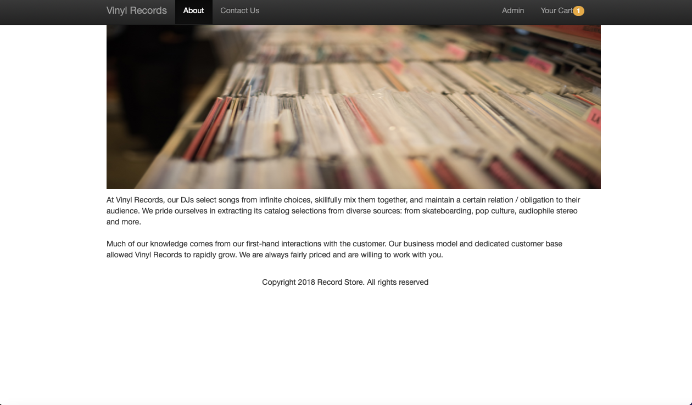
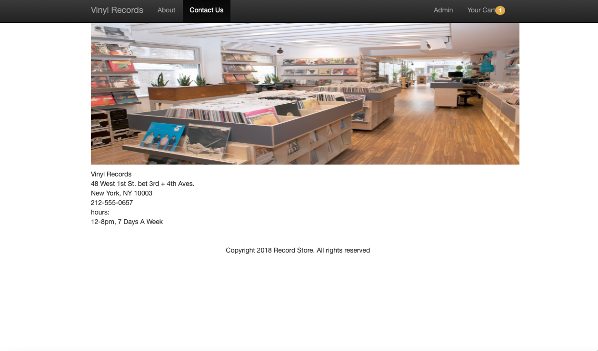
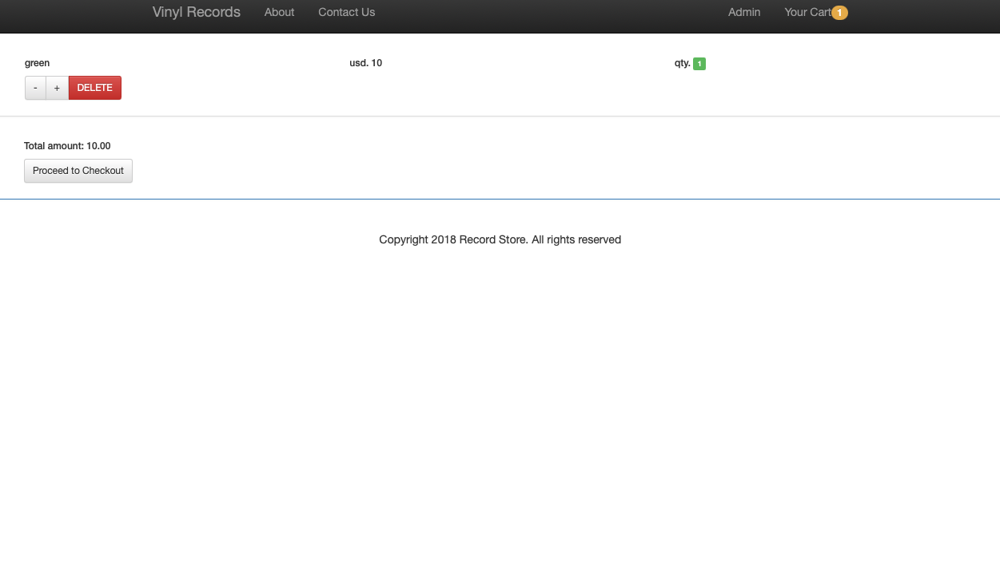

A content management system that allows users to purchase records. An admin panel allows the site owner to add, edit, or delete inventory on the website.

Built with: React-Redux, MongoDB, ExpressJS, NodeJS and React-Boostrap.

# Vinyl-Records

A content management system that allows users to purchase records. An admin panel allows the site owner to add, edit, or delete inventory on the website.

Live demo [_here_](https://destination-finder.herokuapp.com/)

> Local version is working. Currently experiencing problems with Heroku for live version.

## Description

- React App that connects to a NodeJS and Express backend. Communicates data with Mongo Atlas database.
- Admin section to add record price, image, artist and record title. Delete option as well.
- Can purchase records and see in cart

## Technologies Used

- React
- Redux
- MongodDB
- NodeJS
- ExpressJS
- React-Boostrap

## Features

- React-boostrap carousel.
- Admin page to add and delete record details
- Records available for purchase displayed on landing
- responsive
- about section
- cart showing buy now item

## Landing page with carousel and records available for purchase



## About



## Contact Us



## Cart



## 🛠️ Installation Steps

Install dependencies

```bash
npm install
```

### Executing program

Running the following script runs: "node ./bin/www & node apiServer.js"

```
npm start
```

## Contact

Created by [@cfrancisco726](http://www.carlofrancisco.com) - feel free to contact me!
